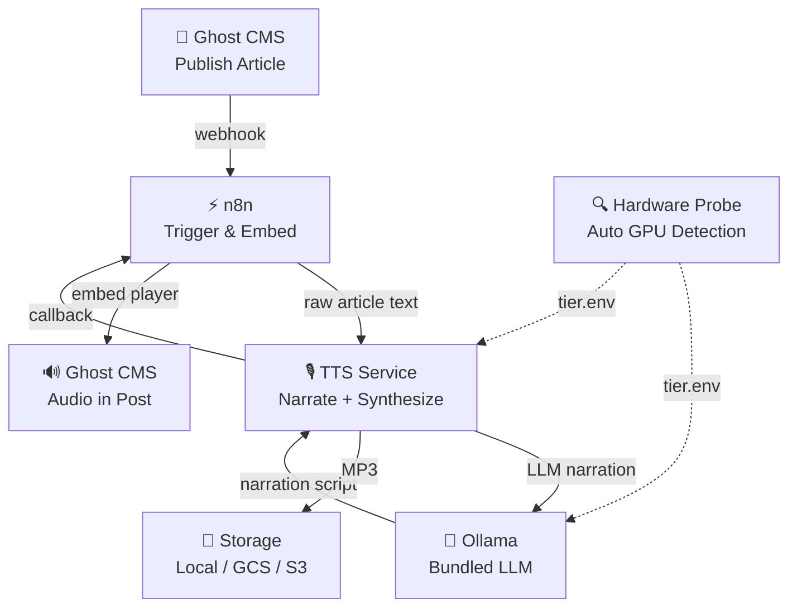

<p align="center">
  
</p>

# Ghost Narrator

Self-hosted AI narration for your blog. Replaces ElevenLabs (~$330/month) with a local stack that costs you electricity.

[](LICENSE)

---

## What It Does

Publish an article on Ghost CMS → Ghost Narrator automatically generates a voice-narrated audio version using your cloned voice and embeds the player in your post. No cloud TTS APIs. No per-character billing. Your voice, your hardware, your data.

```
Ghost CMS (publish) → n8n (trigger) → TTS Service (narrate + synthesize) → Storage (MP3) → Ghost (embed player)
```

> **Read the full story:** [You Cannot Buy What Can Only Be Built](https://founderreality.com/blog/you-cannot-buy-what-can-only-be-built) — why we built this and how it works.

---

## Cost Comparison

| | ElevenLabs Scale | Ghost Narrator |
|---|---|---|
| Monthly cost | ~$330 | $0 (self-hosted) |
| Per-character billing | Yes | No |
| Voice cloning | Yes | Yes (5-120s voice sample) |
| Data privacy | Cloud | 100% local |
| Latency | Fast | ~2-5 min per article |
| Quality | Excellent | Good (some trade-offs) |
| Effort to set up | Sign up | ~1 hour |

---

## What You Need

Ghost Narrator is a standalone project. It needs:

1. **A [Ghost](https://ghost.org/) blog** — the open-source publishing platform ([GitHub](https://github.com/TryGhost/Ghost))
2. **Docker** — with Docker Compose V2
3. **A voice sample** — 5-120 seconds WAV recording of your voice

That's it. The bundled Ollama LLM handles narration rewriting. Qwen3-TTS handles voice synthesis. No external APIs required.

---

## Hardware Tiers

Ghost Narrator auto-detects your hardware and selects the right models:

| Tier | VRAM | TTS Model | LLM Model | Output Quality | Key Features |
|---|---|---|---|---|---|
| CPU only | None | Qwen3-TTS-0.6B | qwen3:1.7b | 192kbps, 44.1kHz | Parallel workers, any machine |
| Low | <9 GB | Qwen3-TTS-0.6B | qwen3:4b-q4 | 192kbps, 44.1kHz | T4 / older GPUs |
| Mid | 9–18 GB | Qwen3-TTS-1.7B | qwen3:8b-q4 | 192kbps, 44.1kHz | Pipelined narrate+synthesize |
| **High** | **18+ GB** | **Qwen3-TTS-1.7B (fp32)** | **qwen3:14b-q4** | **256kbps, 48kHz** | **2 workers, multi-voice, quality re-synth, voice caching** |

Override with `HARDWARE_TIER=cpu_only` in `.env` if auto-detection fails.

---

## Architecture



---

## Prerequisites

**Hardware:**
- Any machine — CPU-only works, GPU recommended for speed
- 8GB+ RAM
- 50GB+ SSD

**Software:**
- Docker with Docker Compose V2
- Git

**You also need:**
- A [Ghost](https://ghost.org/) blog ([open source](https://github.com/TryGhost/Ghost))
- A 5-120 second WAV recording of your voice (45+ seconds recommended)

---

## Quick Start

```bash
# Clone
git clone https://github.com/getsimpledirect/ghost-narrator.git
cd ghost-narrator

# Install (interactive — configures .env, storage, voice sample, Docker images)
./install.sh

# Start
./start.sh up -d
```

Then configure your Ghost site to send webhooks to:
```
http://YOUR_VM_IP:5678/webhook/ghost-published
```

Publish an article. Ghost Narrator handles the rest.

### Storage Options

**Local (default):** Audio files saved to Docker volume. No cloud account needed.

**Google Cloud Storage:** For production, select `gcs` during `./install.sh` or set `STORAGE_BACKEND=gcs` in `.env`.

**AWS S3:** Select `s3` during `./install.sh` or set `STORAGE_BACKEND=s3` in `.env`.

---

## Configuration

### Required

| Variable | Description |
|----------|-------------|
| `GHOST_SITE1_URL` | Your Ghost site URL |
| `GHOST_SITE1_ADMIN_API_KEY` | Ghost Admin API key (Settings → Integrations) |
| `GHOST_KEY_SITE1` | Ghost Content API key |
| `SERVER_EXTERNAL_IP` | VM's external IP for webhooks |
| `N8N_USER` / `N8N_PASSWORD` | n8n admin credentials |
| `N8N_ENCRYPTION_KEY` | Run `openssl rand -hex 32` |

### Optional

| Variable | Description | Default |
|----------|-------------|---------|
| `HARDWARE_TIER` | Override auto-detection | *(auto)* |
| `STORAGE_BACKEND` | `local`, `gcs`, or `s3` | `local` |
| `GCS_BUCKET_NAME` | GCS bucket for audio | *(local if unset)* |
| `S3_BUCKET_NAME` | S3 bucket for audio | *(local if unset)* |
| `MAX_WORKERS` | Parallel workers (CPU mode) | `4` |
| `MAX_CHUNK_WORDS` | Words per TTS chunk | `200` |
| `GHOST_SITE2_URL` | Second Ghost site | *(single site)* |

See [`.env.example`](.env.example) for the full list.

### LLM Override

Ghost Narrator bundles Ollama for narration rewriting. No external LLM needed. To override with a different OpenAI-compatible endpoint, set `LLM_BASE_URL` in `.env`:

| Provider | `LLM_BASE_URL` | `LLM_MODEL_NAME` |
|----------|------------------|--------------------|
| Bundled Ollama (default) | `http://ollama:11434/v1` | *(auto from tier)* |
| OpenAI API | `https://api.openai.com/v1` | `gpt-4o-mini` |
| Any OpenAI-compatible API | `http://host.docker.internal:PORT/v1` | model name |

---

## Multi-Site Support

Ghost Narrator supports multiple Ghost sites. The workflow automatically detects which site a post belongs to by matching the webhook URL hostname against your configured `GHOST_SITE1_URL` and `GHOST_SITE2_URL`.

See the [n8n Setup Guide](n8n/SETUP_GUIDE.md) for adding more sites.

---

## Troubleshooting

| Problem | Solution |
|---------|----------|
| TTS health check times out | First run downloads models. Wait up to 5 min. |
| Webhooks don't trigger | Check `SERVER_EXTERNAL_IP` and firewall on port 5678. |
| Audio not embedded in Ghost | Verify Admin API key. Check: `docker compose logs n8n` |
| Ollama errors | Check: `docker compose logs ollama` |
| GPU not detected | Run `nvidia-smi`. Set `HARDWARE_TIER=mid_vram` to override. |

```bash
# Health checks
curl http://localhost:8020/health   # TTS Service
curl http://localhost:5678/healthz  # n8n
curl http://localhost:11434/api/tags # Ollama
```

---

## Licensing

Ghost Narrator's code is MIT licensed — do whatever you want with it.

**Qwen3-TTS (default TTS model)**
- Licensed under [Apache 2.0](https://www.apache.org/licenses/LICENSE-2.0)
- Fully permissive — commercial use allowed
- Repo: [Qwen/Qwen3-TTS on Hugging Face](https://huggingface.co/Qwen/Qwen3-TTS)

**Qwen3 LLM (default narration model)**
- Licensed under [Apache 2.0](https://www.apache.org/licenses/LICENSE-2.0)
- Fully permissive — commercial use allowed

**Target state:** MIT code + Apache 2.0 models = fully permissive end-to-end. No licensing asterisks.

You are responsible for complying with the licenses of the underlying models you choose to use.

---

## Documentation

- [Architecture Guide](docs/ARCHITECTURE.md) — full pipeline walkthrough
- [TTS Service Docs](tts-service/README.md) — API reference & standalone usage
- [TTS Quick Start](tts-service/QUICKSTART.md) — get TTS running in 5 minutes
- [n8n Setup Guide](n8n/SETUP_GUIDE.md) — workflow configuration
- [Contributing](CONTRIBUTING.md)
- [Security Policy](SECURITY.md)

---

## License

MIT License (code). See [Licensing](#licensing) for model license details.

---

## Support

- [GitHub Issues](https://github.com/getsimpledirect/ghost-narrator/issues)
- [GitHub Discussions](https://github.com/getsimpledirect/ghost-narrator/discussions)

---

Built by [SimpleDirect](https://getsimpledirect.com)
