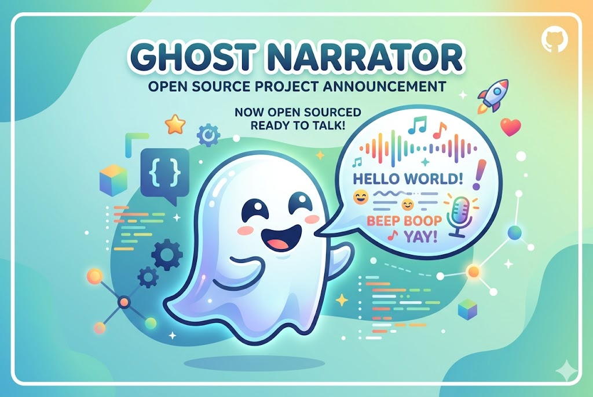
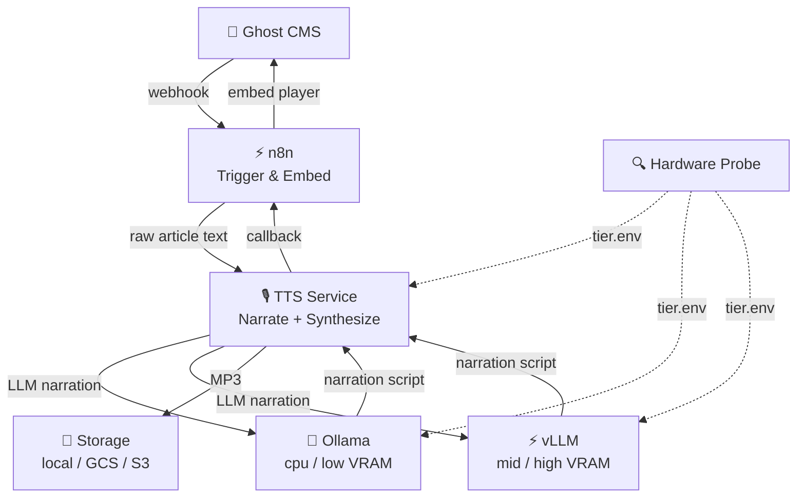

<p align="center">
  
</p>

# Ghost Narrator

Self-hosted AI narration for your blog. Replaces ElevenLabs (~$330/month) with a local stack that costs you electricity.

<p align="center">
  <a href="LICENSE"></a>
  <a href="https://github.com/getsimpledirect/ghost-narrator/stargazers"></a>
  <a href="https://github.com/getsimpledirect/ghost-narrator/issues"></a>
  <a href="https://github.com/getsimpledirect/ghost-narrator/commits/main"></a>
  <a href="https://www.python.org/"></a>
  <a href="https://docs.docker.com/compose/"></a>
</p>

---

## What It Does

Ghost Narrator has two modes:

**Auto-narration (Ghost CMS):** Publish an article → Ghost Narrator automatically generates a voice-narrated audio version using your cloned voice and embeds the player in your post.

```
Ghost CMS (publish) → n8n (trigger) → TTS Service (narrate + synthesize) → Storage (MP3) → Ghost (embed player)
```

**Static / arbitrary text:** Send any plain text to the TTS service directly via its REST API or the bundled `static-content-audio-pipeline.json` n8n workflow — no Ghost required. Use for books, series content, landing pages, or any text you want narrated.

No cloud TTS APIs. No per-character billing. Your voice, your hardware, your data.

> **Read the full story:** [You Cannot Buy What Can Only Be Built](https://founderreality.com/blog/you-cannot-buy-what-can-only-be-built) — why we built this and how it works.

---

## Cost Comparison

| | ElevenLabs Scale | Ghost Narrator |
|---|---|---|
| Monthly cost | ~$330 | $0 (self-hosted) |
| Per-character billing | Yes | No |
| Voice cloning | Yes | Yes (5-120s voice sample) |
| Data privacy | Cloud | 100% local |
| Latency | Fast | ~5-30 min (GPU) / longer on CPU |
| Quality | Excellent | Good to excellent (depends on tier) |
| Effort to set up | Sign up | ~1 hour |

---

## What You Need

Ghost Narrator is a standalone project. It needs:

1. **A [Ghost](https://ghost.org/) blog** — the open-source publishing platform ([GitHub](https://github.com/TryGhost/Ghost))
2. **Docker** — with Docker Compose V2
3. **A voice sample** — 5-120 seconds WAV recording of your voice

That's it. The bundled LLM handles narration rewriting — Ollama (CPU/low-VRAM) or vLLM (GPU). Qwen3-TTS handles voice synthesis. No external APIs required.

---

## Hardware Tiers

Ghost Narrator auto-detects your hardware and selects the right models:

| Tier | VRAM | TTS Model | LLM Model | Output Quality | Key Features |
|---|---|---|---|---|---|
| CPU only | None | Qwen3-TTS-0.6B | qwen3.5:2b (Ollama) | 192kbps, 48kHz | Parallel workers, any machine |
| Low | <12 GB | Qwen3-TTS-0.6B (fp32) | qwen3.5:4b (Ollama) | 192kbps, 48kHz | Compatible with all CUDA GPUs incl. older hardware |
| Mid | 12–18 GB | Qwen3-TTS-1.7B (fp16) | Qwen3.5-4B (vLLM fp8, 8K ctx) | 256kbps, 48kHz | Pipelined narrate+synthesize, VRAM-probed segments (up to 400 words) |
| **High** | **18+ GB** | **Qwen3-TTS-1.7B (bf16)** | **Qwen3.5-9B (vLLM fp8, 64K ctx)** | **320kbps, 48kHz** | **Pipelined narrate+synthesize, VRAM-probed segments (up to 400 words), multi-voice, quality re-synth, voice caching** |

Override with `HARDWARE_TIER=cpu_only` in `.env` if auto-detection fails.

---

## Architecture



---

## Prerequisites

**Hardware:**
- Any machine — CPU-only works, GPU recommended for speed
- 8GB+ RAM
- 50GB+ SSD

**Software:**
- Docker with Docker Compose V2
- Git

**You also need:**
- A [Ghost](https://ghost.org/) blog ([open source](https://github.com/TryGhost/Ghost))
- A 5-120 second WAV recording of your voice (45+ seconds recommended)

---

## Quick Start

```bash
git clone https://github.com/getsimpledirect/ghost-narrator.git
cd ghost-narrator

# Interactive setup — configures .env, storage, voice sample, and starts services
./install.sh
```

**GPU users:** `install.sh` auto-detects your GPU and uses `docker-compose.gpu.yml`. To start manually with GPU: `docker compose -f docker-compose.gpu.yml up -d`

After startup, import the n8n workflows:
1. Open `http://YOUR_VM_IP:5678` → log in
2. **Workflows → Import from File** → upload `n8n/workflows/ghost-audio-pipeline.json`
3. Repeat for `n8n/workflows/ghost-audio-callback.json`

Then configure your Ghost site to send webhooks to:
```
http://YOUR_VM_IP:5678/webhook/ghost-published
```

Verify everything is running:
```bash
curl http://localhost:8020/health/ready   # TTS engine ready
curl http://localhost:5678/healthz        # n8n healthy
```

Publish an article. Ghost Narrator handles the rest.

### Storage Options

**Local (default):** Audio files saved to Docker volume. No cloud account needed.

**Google Cloud Storage:** For production, select `gcs` during `./install.sh` or set `STORAGE_BACKEND=gcs` in `.env`.

**AWS S3:** Select `s3` during `./install.sh` or set `STORAGE_BACKEND=s3` in `.env`.

---

## Configuration

### Required

| Variable | Description |
|----------|-------------|
| `GHOST_SITE1_URL` | Your Ghost site URL |
| `GHOST_SITE1_ADMIN_API_KEY` | Ghost Admin API key (Settings → Integrations) |
| `GHOST_KEY_SITE1` | Ghost Content API key |
| `SERVER_EXTERNAL_IP` | VM's external IP for webhooks |
| `N8N_USER` / `N8N_PASSWORD` | n8n owner credentials — `N8N_USER` must be a valid email (e.g. `admin@localhost`) |
| `N8N_ENCRYPTION_KEY` | Run `openssl rand -hex 32` |

### Optional

| Variable | Description | Default |
|----------|-------------|---------|
| `HARDWARE_TIER` | Override auto-detection | *(auto)* |
| `VOICE_SAMPLE_REF_TEXT` | Transcription of your reference audio for higher-quality ICL cloning; leave blank for x-vector-only mode | *(empty)* |
| `STORAGE_BACKEND` | `local`, `gcs`, or `s3` | `local` |
| `GCS_BUCKET_NAME` | GCS bucket for audio | *(local if unset)* |
| `S3_BUCKET_NAME` | S3 bucket for audio | *(local if unset)* |
| `MAX_WORKERS` | Parallel workers (CPU mode) | `4` |
| `MAX_CHUNK_WORDS` | Words per TTS chunk | `200` |
| `SINGLE_SHOT_MAX_WORDS` | Max words for single-pass synthesis | `400` |
| `SINGLE_SHOT_SEGMENT_WORDS` | Words per segment — overrides automatic VRAM-probed sizing | *(auto)* |
| `SINGLE_SHOT_OVERLAP_MS` | Overlap crossfade between segments (ms) | `500` |
| `GHOST_SITE2_URL` | Second Ghost site | *(single site)* |

See [`.env.example`](.env.example) for the full list.

### Using an External LLM Provider

By default Ghost Narrator uses a bundled LLM for narration — Ollama (cpu/low VRAM tiers) or vLLM (mid/high VRAM tiers). To use an external OpenAI-compatible API instead:

```env
LLM_BASE_URL=https://api.openai.com/v1
LLM_API_KEY=sk-your-api-key
LLM_MODEL_NAME=gpt-4o-mini
```

Set these in `.env` before running `docker compose up`.

### Auto-Generated Secrets

`install.sh` automatically generates the following credentials on first run — you do not need to set them manually:

| Variable | Purpose |
|----------|---------|
| `REDIS_PASSWORD` | Redis auth (port not exposed to host) |
| `N8N_ENCRYPTION_KEY` | n8n credential encryption |
| `N8N_GHOST_WEBHOOK_SECRET` | HMAC-SHA256 signature verification for Ghost webhooks |
| `TTS_API_KEY` | Bearer token required by the TTS service API |

Set the same `N8N_GHOST_WEBHOOK_SECRET` value in Ghost Admin → Settings → Integrations → Webhooks. All other secrets are internal and never need to leave your server.

### Redis Authentication (v2+)

Redis is password-protected by default and the port is no longer exposed to the host. The `install.sh` script automatically generates `REDIS_PASSWORD` in `.env`.

**Upgrading from a previous version:**
```bash
docker compose down
# Add REDIS_PASSWORD to .env (or re-run install.sh)
docker compose up -d
```

### Multi-Voice Profiles

The `/voices/upload` endpoint accepts a WAV file to register a named voice profile. Profiles are stored under `voices/<profile-name>/reference.wav`.

To use a non-default profile, set `voice_profile` in your TTS request:
```json
{ "text": "Hello", "voice_profile": "my-custom-voice" }
```

The default profile (`voices/default/`) is set up during `install.sh`.

### Disk Management (Local Storage)

When `STORAGE_BACKEND=local`, generated MP3 files are written to the `tts_output` Docker volume and are **not automatically deleted** when job metadata expires (24h Redis TTL).

To clean up files older than 7 days:
```bash
docker compose exec tts-service find /app/output -name "*.mp3" -mtime +7 -delete
```

GCS and S3 backends are not affected — audio lives in your bucket with its own lifecycle policy.

### LLM Override

Ghost Narrator bundles its own LLM for narration rewriting — no external API needed. The backend is selected by `install.sh` based on your hardware. To use an external OpenAI-compatible API instead, set `LLM_BASE_URL` in `.env`:

| Provider | `LLM_BASE_URL` | `LLM_MODEL_NAME` |
|----------|------------------|--------------------|
| Bundled Ollama (cpu / low VRAM) | `http://ollama:11434/v1` | *(auto from tier)* |
| Bundled vLLM (mid / high VRAM) | `http://vllm:8000/v1` | *(auto from tier)* |
| OpenAI API | `https://api.openai.com/v1` | `gpt-4o-mini` |
| Any OpenAI-compatible API | `http://host.docker.internal:PORT/v1` | model name |

---

## Multi-Site Support

Ghost Narrator supports multiple Ghost sites. The workflow automatically detects which site a post belongs to by matching the webhook URL hostname against your configured `GHOST_SITE1_URL` and `GHOST_SITE2_URL`.

See the [n8n Setup Guide](n8n/SETUP_GUIDE.md) for adding more sites.

### Adding a Third Ghost Site

To add a third Ghost site beyond the default two:

1. Add env vars to `.env`:
   ```env
   GHOST_SITE3_URL=https://your-third-site.com
   GHOST_SITE3_ADMIN_API_KEY=your-admin-key
   ```

2. In `n8n/workflows/ghost-audio-pipeline.json`, find the site detection Code node and add a third branch.

3. In `n8n/workflows/ghost-audio-callback.json`, add the third case in `Extract API Keys`.

4. Re-import both updated workflow JSON files in the n8n UI.

The `siteSlug` convention: use `'site1'`, `'site2'`, `'site3'` to match the env var suffix.

### Production Deployment

For production deployment beyond local development:

1. **Firewall**: Restrict access to Docker network only — don't expose Redis (port 6379), Ollama (port 11434), or vLLM (port 8000) to host
2. **Reverse Proxy**: Use Traefik or nginx to expose only the TTS service (port 8020) and n8n (port 5678)
3. **SSL**: Terminate TLS at the reverse proxy, not in containers
4. **Monitoring**: The service exposes Prometheus metrics at `/metrics` — integrate with Grafana
5. **Backup**: Regularly backup the `n8n_data` and `tts_output` volumes

---

## Troubleshooting

| Problem | Solution |
|---------|----------|
| TTS health check times out | First run downloads models. Wait up to 5 min. |
| Webhooks don't trigger | Check `SERVER_EXTERNAL_IP` and firewall on port 5678. |
| Audio not embedded in Ghost | Verify Admin API key. Check: `docker compose logs n8n` |
| LLM errors (cpu/low VRAM) | Check: `docker compose logs ollama` |
| LLM errors (mid/high VRAM) | Check: `docker compose logs vllm` |
| GPU not detected | Run `nvidia-smi`. Set `HARDWARE_TIER=mid_vram` to override. |

```bash
# Health checks
curl http://localhost:8020/health       # TTS Service
curl http://localhost:5678/healthz      # n8n
curl http://localhost:11434/api/tags    # Ollama (cpu/low VRAM)
curl http://localhost:8000/health       # vLLM (mid/high VRAM)
```

---

## Licensing

Ghost Narrator's code is MIT licensed — do whatever you want with it.

**Qwen3-TTS (default TTS model)**
- Licensed under [Apache 2.0](https://www.apache.org/licenses/LICENSE-2.0)
- Fully permissive — commercial use allowed
- Repo: [Qwen/Qwen3-TTS on Hugging Face](https://huggingface.co/Qwen/Qwen3-TTS)

**Qwen3.5 LLM (default narration model)**
- Licensed under [Apache 2.0](https://www.apache.org/licenses/LICENSE-2.0)
- Fully permissive — commercial use allowed

**Target state:** MIT code + Apache 2.0 models = fully permissive end-to-end. No licensing asterisks.

You are responsible for complying with the licenses of the underlying models you choose to use.

---

## Documentation

- [Architecture Guide](docs/ARCHITECTURE.md) — full pipeline walkthrough including resilience & observability features
- [TTS Service Docs](tts-service/README.md) — API reference & standalone usage
- [TTS Quick Start](tts-service/QUICKSTART.md) — get TTS running in 5 minutes
- [n8n Setup Guide](n8n/SETUP_GUIDE.md) — workflow configuration
- [Contributing](CONTRIBUTING.md)
- [Security Policy](SECURITY.md)

---

## License

MIT License (code). See [Licensing](#licensing) for model license details.

---

## Support

- [GitHub Issues](https://github.com/getsimpledirect/ghost-narrator/issues)
- [GitHub Discussions](https://github.com/getsimpledirect/ghost-narrator/discussions)

---

Built by [SimpleDirect](https://getsimpledirect.com)
