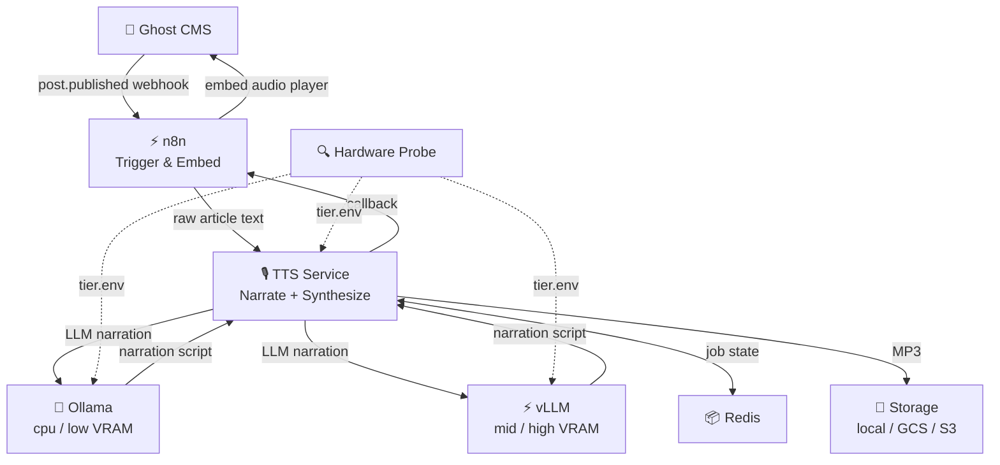
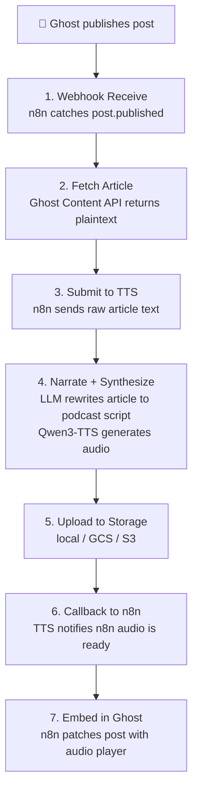

# Ghost Narrator — Complete Architecture & Setup Guide

> **Automated voice-narrated audio from your Ghost CMS articles or any plain text, powered by Qwen3-TTS voice cloning and bundled Qwen3.5 LLM inference (Ollama on CPU/low VRAM, vLLM on mid/high VRAM).**

---

## Table of Contents

1. [What This Pipeline Does](#what-this-pipeline-does)
2. [Architecture Overview](#architecture-overview)
3. [Hardware Tier Detection](#hardware-tier-detection)
4. [Narration Pipeline](#narration-pipeline)
5. [Build & Deployment](#build--deployment)
6. [TTS Service Overview](#tts-service-overview)
7. [Component Deep Dive](#component-deep-dive)
8. [Storage Backends](#storage-backends)
9. [Voice Profiles](#voice-profiles)
10. [VRAM Budget & Resource Planning](#vram-budget--resource-planning)
11. [Service Startup Sequence](#service-startup-sequence)
12. [Directory Structure](#directory-structure)
13. [Step-by-Step Setup](#step-by-step-setup)
14. [n8n Workflow — Node-by-Node Explanation](#n8n-workflow--node-by-node-explanation)
15. [Ghost Webhook Configuration](#ghost-webhook-configuration)
16. [Voice Clone Preparation](#voice-clone-preparation)
17. [Storage Setup](#storage-setup)
18. [Testing & Troubleshooting](#testing--troubleshooting)
19. [Backfilling Audio for Existing Posts](#backfilling-audio-for-existing-posts)
20. [Cost Analysis](#cost-analysis)

---

## What This Pipeline Does

Ghost Narrator has two operating modes:

### Mode 1: Ghost CMS Auto-Narration
Every time you publish a post on your [Ghost](https://ghost.org/) website, the pipeline automatically:

1. **Detects** the new article via a Ghost webhook
2. **Fetches** the full article text using the Ghost Content API
3. **Submits** the raw article text to the TTS service
4. **Narrates** — the TTS service rewrites the article into podcast-style narration using **Qwen3.5** (via Ollama on cpu/low VRAM, or vLLM on mid/high VRAM)
5. **Synthesises** audio using **Qwen3-TTS** with your **cloned voice** (from your reference sample)
   - **CPU Mode**: Parallel synthesis with configurable workers (default: 4 workers, ~50-60s for 2000 words)
   - **GPU Mode**: Sequential synthesis (~20-30s for 2000 words)
6. **Uploads** the MP3 to your configured **storage backend** (local, GCS, or S3) at a predictable path
7. **Embeds** an HTML5 audio player back into the Ghost post (optional)

### Mode 2: Static / Arbitrary Text Narration
The TTS service accepts any plain text via its REST API or via the bundled `static-content-audio-pipeline.json` n8n workflow. Use this for:
- Book chapters, series content, or landing page copy
- Backfilling audio for content hosted outside Ghost
- Any text-to-speech job that should not trigger a Ghost embed

```bash
# Direct API call
curl -X POST http://localhost:8020/tts/generate \
  -H "Authorization: Bearer $TTS_API_KEY" \
  -H "Content-Type: application/json" \
  -d '{"text": "Your content here.", "job_id": "my-book-chapter-1"}'
```

Or POST to `http://YOUR_IP:5678/webhook/static-content-audio` with `plain_text`, `job_id`, and `storage_path` fields — the workflow handles submission, polling, and storage without touching Ghost.

**Key Features:**
- Zero-shot voice cloning from a short reference audio sample
- Qwen3.5 LLM narration rewriting — better factual preservation and instruction-following than Qwen3
- Professional audio mastering (EBU R128 two-pass loudnorm, −16 LUFS target, speech compressor, true-peak limiter)
- Short studio segments (60-100 words per tier) + best-of-N per segment + neural enhancement — a per-tier quality pipeline that keeps every synthesis call inside the model's competent AR horizon
- torch.compile() acceleration on GPU — first-call JIT penalty (~30-60s), then 2-4× faster synthesis
- Streaming concatenation for memory-efficient processing of long articles (5000+ words)
- Redis-backed job persistence with automatic fallback to in-memory storage
- Async processing with webhook callbacks

---

## Architecture Overview



---

## Resilience & Observability Features

### Circuit Breaker
The notification service uses a circuit breaker pattern to prevent cascading failures when external services (n8n, Ghost API) are unavailable. If the failure threshold is exceeded, the circuit opens and fails fast, allowing the external service time to recover.

Configuration (via environment):
- `CIRCUIT_BREAKER_FAILURE_THRESHOLD`: Number of failures before opening (default: 5)
- `CIRCUIT_BREAKER_RECOVERY_TIMEOUT`: Seconds before attempting recovery (default: 30)

### API Versioning
All TTS service endpoints support versioning via the `Accept-Version` header. This allows clients to specify which API version they expect.

Example:
```bash
curl -H "Accept-Version: v1" http://localhost:8020/tts/generate
```

### Prometheus Metrics
The service exposes Prometheus metrics at `/metrics` for monitoring:

| Metric | Type | Description |
|--------|------|-------------|
| `tts_jobs_total` | Counter | Total TTS jobs by status |
| `tts_synthesis_duration_seconds` | Histogram | Audio synthesis time |
| `tts_narration_duration_seconds` | Histogram | LLM narration time |
| `tts_chunks_total` | Counter | Audio chunks processed |
| `tts_storage_upload_duration_seconds` | Histogram | Storage upload time |

### Distributed Tracing
OpenTelemetry tracing is integrated for distributed request tracing across services. Configure via environment:

- `OTEL_SERVICE_NAME`: Service name for traces (default: ghost-narrator-tts)
- `OTEL_EXPORTER_OTLP_ENDPOINT`: OTLP collector endpoint (optional)

### Bulkhead Pattern
Job processing uses bulkhead isolation to separate short and long article processing:
- Short jobs (<1000 words): Up to 4 concurrent, 60s timeout
- Long jobs (>=1000 words): 1 concurrent, 300s timeout

### Rate Limiting
API endpoints are rate-limited to prevent abuse:
- Default: 60 requests per minute per IP
- Health and metrics endpoints are excluded
- Returns 429 status with `Retry-After` header when exceeded

---

## Hardware Tier Detection

Ghost Narrator auto-detects your hardware at startup and selects the optimal TTS model and output settings.

| Tier | VRAM | TTS Model | LLM | Output Quality | Features |
|---|---|---|---|---|---|
| CPU only | None | Qwen3-TTS-0.6B | qwen3.5:2b | 192kbps, 48kHz | Parallel workers, any machine |
| Low | <12 GB | Qwen3-TTS-0.6B (fp32) | qwen3.5:4b (Ollama) | 192kbps, 48kHz | Compatible with all CUDA GPUs incl. older hardware |
| Mid | 12–18 GB | Qwen3-TTS-1.7B (fp16) | Qwen3.5-4B (vLLM fp8, 8K ctx) | 256kbps, 48kHz | RTX 3080 12GB+ / A10G, 70-word studio segments, best-of-3 per segment, response ladder, DeepFilterNet enhancement |
| **High** | **18+ GB** | **Qwen3-TTS-1.7B (bf16)** | **Qwen/Qwen3.5-9B (vLLM fp8, 64K ctx)** | **320kbps, 48kHz, −14 LUFS** | **60-word studio segments, best-of-3 per segment, response ladder, DeepFilterNet enhancement, loudness consistency, LLM completeness, voice pre-caching** |

**Studio-quality pipeline (all tiers, tuned per-tier):**
- **Short studio segments** — every segment stays inside the model's competent AR horizon (CPU 100w, LOW 80w, MID 70w, HIGH 60w). Long-form narration is synthesized as many short calls rather than a few long ones; per-segment AR drift is bounded and cannot propagate.
- **Consistent reference conditioning** — every segment conditions on the same clean voice reference (`VOICE_SAMPLE_PATH`), not the tail of the previous segment. Voice identity anchors globally; the tiny prosodic reset at segment joins is masked by a crossfade.
- **Best-of-N per segment** — each segment is synthesized N times with distinct seeds (CPU 1, LOW 2, MID 3, HIGH 3) and scored on a composite of F0 drift, WER, mid-phrase drop density, and spectral flatness. The lowest-scoring variant is kept; oversampling converts per-sample variance into a statistically-bounded quality floor.
- **Composite scoring** — weights default to F0 0.40, WER 0.30, drops 0.20, flatness 0.10. Tunable via `COMPOSITE_SCORE_W_F0` / `_WER` / `_DROPS` / `_FLATNESS` env vars for calibration runs.
- **Graduated response ladder** — when a segment fails the acoustic gate after best-of-N, escalation is proportional: heal 1–3 drops in place (cosmetic) → seed-sweep of 5 variants (stochastic) → split at punctuation and synthesize halves with best-of-3 (structural) → flag and ship lowest-scoring variant. Only failures where no variant synthesizes at all abort the job.
- **DeepFilterNet enhancement** — post-concatenation neural restoration (MIT, real-time on CPU, CUDA-accelerated). Removes the vocoded texture and noise fingerprint characteristic of TTS output, pulling the waveform toward a natural-recording prior. Runs before mastering so the LUFS limiter acts on the enhanced signal.
- **Precision tier**: bf16 on HIGH_VRAM — fp32-equivalent exponent range avoids logit saturation on long AR decodes that surfaced as amplitude drops under fp16. fp16 retained on MID_VRAM and fp32 on LOW/CPU.

**HIGH_VRAM additional features:**
- **Pre-computed voice reference** — voice embedding cached at startup, saves 2-5s per job
- **LLM completeness check** — second LLM call verifies no facts were dropped during narration (short articles only, combined ≤ 4000 words)

Detection is performed by `scripts/init/hardware-probe.sh`, which runs as a Docker init container before the other services start. It inspects `nvidia-smi` output, writes the selected tier to `tier_data:/shared/tier.env`, and exits. Both `tts-service` and `ollama` mount this volume read-only and read the tier at startup. Override with `HARDWARE_TIER=cpu_only|low_vram|mid_vram|high_vram` in `.env`.

---

## Narration Pipeline

The end-to-end narration pipeline has seven stages:



1. **Webhook Receive** — n8n catches the Ghost `post.published` event
2. **Fetch Article** — Ghost Content API returns full plaintext
3. **Submit to TTS** — n8n sends raw article text to the TTS service
4. **Narrate + Synthesize** — TTS service internally: (a) deterministic preprocessing strips URLs/markdown, (b) Qwen3.5 LLM (Ollama on cpu/low VRAM, vLLM on mid/high VRAM) rewrites to spoken prose preserving all facts, (c) Qwen3-TTS synthesizes short studio segments with best-of-N selection, (d) DeepFilterNet enhancement + mastering + concatenation
5. **Upload to Storage** — MP3 uploaded to configured backend (local/GCS/S3)
6. **Callback to n8n** — TTS service notifies n8n that audio is ready
7. **Embed in Ghost** — n8n patches the Ghost post with an `<audio>` player

---

## Build & Deployment

### TTS Service Build Architecture

The TTS service uses a **modern uv-based Dockerfile** for deterministic and lightning-fast dependency resolution, eliminating the legacy `resolution-too-deep` errors that often plagued PyTorch + Transformers environments.

**Build Strategy:**
- Utilizes `uv` for rust-based, parallel dependency resolution and installation.
- Eliminates legacy O(n!) pip resolution timeouts.
- Pre-downloads Qwen3-TTS and Whisper weights during the image build for faster cold starts.
- Integrates comprehensive health checks validating critical library imports (PyTorch, librosa).
- Total build time: 2-5 minutes (first build), <30 seconds (cached)

### Resource Requirements

**Minimum for Build:**
- **RAM**: 8GB allocated to Docker Desktop
- **Disk Space**: 20GB free (includes base images, layers, models)
- **Network**: Stable connection (~3GB download for models + packages)
- **Time**: 2-5 minutes first build, model download can add 2-3 minutes

**Runtime Resources (per docker-compose.yml):**
- **CPU Mode (Recommended)**: 1GB RAM, 4 CPU cores per worker
  - Parallel synthesis with configurable MAX_WORKERS
  - Default: 4 workers = ~50-60s for 2000-word article
  - Memory-efficient streaming concatenation for large files
- **GPU Mode**: 3GB VRAM, 6GB RAM
  - Sequential synthesis
  - ~20-30s for 2000-word article

### Service Startup

Use `docker compose` to bring up all services:

```bash
docker compose up -d        # Start all services in background
docker compose down          # Stop all services
docker compose logs -f       # Tail logs from all services
docker compose restart tts-service   # Restart a single service
```

`install.sh` handles:
1. Hardware detection and model selection (writes `COMPOSE_FILE` to `.env`)
2. `.env` creation and validation
3. Docker Compose orchestration
4. Health check polling

### Common Build Issues & Solutions

#### 1. Dependency Resolution Error
```
error: resolution-too-deep
× Dependency resolution exceeded maximum depth
```

**Solution:** Already fixed in Dockerfile. If you still see this:
- Use `--no-cache` flag: `docker compose build --no-cache tts-service`
- Ensure you're using the latest Dockerfile (uv-based build)
- Verify 8GB+ RAM allocated to Docker

#### 2. Out of Memory (Build Killed)
```
Killed
exit code: 137
```

**Solution:**
- Increase Docker Desktop memory: Settings → Resources → Memory → 8GB+
- Close other applications during build
- Check available system RAM: `free -h` (Linux) or Activity Monitor (Mac)

#### 3. No Space Left on Device
```
no space left on device
write /var/lib/docker: no space left on device
```

**Solution:**
```bash
# Clean Docker system
docker system prune -a --volumes

# Check disk usage
docker system df

# Ensure 20GB+ free space
df -h
```

#### 4. Network Timeout
```
ReadTimeoutError: HTTPSConnectionPool
Could not fetch URL
```

**Solution:**
- Check internet connection stability
- The Dockerfile already sets `PIP_DEFAULT_TIMEOUT=300` and `PIP_RETRIES=5`
- If in restricted network, configure pip mirror in Dockerfile
- Retry build (network issues are often transient)

#### 5. Model Download Warnings
```
⚠ Qwen3-TTS model download failed - will download on first use
```

**Impact:** This is a warning, not a fatal error. Models download automatically when the service starts.

**To pre-download during build:**
- Ensure stable internet connection during build
- Models are cached in Docker volume `tts_model_cache`
- Total download: ~3GB (Qwen3-TTS ~2GB + Whisper models ~75MB + dependencies)

### Manual Build (Advanced)

For detailed build output and debugging:

```bash
cd tts-service

# Build with full progress output
docker build --progress=plain --no-cache -t ghost-tts-service:latest .

# Validate built image
docker run --rm ghost-tts-service:latest python -c "
import torch
import fastapi
print('✓ All critical imports successful')
"
```

### Production Deployment Checklist

Before deploying to production:

- [ ] Environment variables configured in `.env`
- [ ] Voice reference file prepared (`tts-service/voices/default/reference.wav`)
- [ ] Docker Desktop allocated 8GB+ RAM
- [ ] 20GB+ free disk space available
- [ ] Stable internet connection for initial build
- [ ] Firewall allows ports: 5678 (n8n), 8020 (TTS), 6379 (Redis), 11434 (Ollama, cpu/low VRAM) or 8000 (vLLM, mid/high VRAM)
- [ ] Ghost webhook URLs configured in Ghost admin
- [ ] Storage backend configured (local, GCS, or S3)
- [ ] LLM service running — Ollama (`docker compose logs ollama`) or vLLM (`docker compose logs vllm`)

### Verifying Successful Build

After build completes, verify the installation:

```bash
# Quick validation
docker run --rm ghost-tts-service:latest python -c "import torch; print('OK')"

# Check service starts
docker compose up -d
# Wait 2-3 minutes for startup
curl http://localhost:8020/health
```

Expected response:
```json
{"status": "healthy", "device": "cpu", "model": "qwen3-tts-0.6b", "voice_sample": true, "model_loaded": true, "reference_audio_present": true, "reference_text_present": true, "tts_engine_ready": true, "job_store": "redis", "jobs_count": 0, "max_workers": 4, "executor_active": true, "storage_client_active": true}
```

---

## TTS Service Overview

### Technology Stack
- **Engine**: Qwen3-TTS (state-of-the-art zero-shot TTS with voice cloning)
- **Framework**: FastAPI + Uvicorn
- **Audio Processing**: librosa, soundfile, pydub, pytorch
- **Storage**: Local folder, Google Cloud Storage, or AWS S3
- **Job Queue**: Redis for async job tracking with AOF persistence
- **Synthesis Strategy**:
  - **CPU Mode**: Parallel single-shot synthesis with ThreadPoolExecutor (configurable workers)
  - **GPU Mode**: Sequential single-shot synthesis (optimal for CUDA memory management)
- **Audio Mastering**: Two-pass EBU R128 loudness normalization, true-peak limiting, −16 LUFS final output

**Key Features:**
- Zero-shot voice cloning from a single reference audio file
- Async background job processing with Redis-backed status tracking
- Automatic fallback to in-memory storage if Redis is unavailable
- Short studio segments (60-100 words per tier) with consistent clean-reference conditioning — keeps every synthesis call inside Qwen3-TTS's competent AR horizon, so pitch, pacing, and timbre stay stable across long narration
- Best-of-N per segment with composite quality scoring (F0 drift, WER, drop density, spectral flatness) — oversampling converts per-sample variance into a statistically-bounded quality floor
- Graduated response ladder when a segment fails the gate: heal → seed-sweep → split → flag (ship best-scoring variant rather than abort the job)
- Neural speech enhancement (DeepFilterNet 2) between concat and mastering — removes the vocoded texture characteristic of TTS output
- Professional audio mastering (two-pass EBU R128 loudnorm, speech compressor, true-peak limiter)
- Exponential-backoff retry on storage uploads and n8n callbacks

---

## Component Deep Dive

### 1. n8n — The Orchestrator

**Why n8n?** Visual workflow automation that's self-hosted and open-source:

- **Native webhook triggers** — Ghost POSTs to a URL, no polling needed
- **Built-in storage nodes** — upload files without custom code
- **Visual workflow editor** — debug, replay, and modify without touching code
- **Execution history** — see exactly what happened for every article processed
- Runs as a Docker container (2 GB RAM limit, ~200–800 MB typical usage)
- Free, open-source, self-hosted

**How it works in this pipeline:** n8n acts as the "traffic controller." It receives the webhook from Ghost, fetches the article text, submits it to the TTS service, and then embeds the audio player back in Ghost — all wired together visually.

**Workflows:**
1. **ghost-audio-pipeline.json**: Main trigger workflow (Ghost webhook → fetch article → submit to TTS)
2. **ghost-audio-callback.json**: Callback embedder workflow (TTS complete → Ghost update)
3. **static-content-audio-pipeline.json**: Arbitrary text workflow — accepts `POST /webhook/static-content-audio` with `plain_text`, `job_id`, and `storage_path` fields; submits to TTS service and handles storage without any Ghost interaction. Use for book chapters, series content, or any non-Ghost text source.

---

### 1.5 Redis — Job Persistence Layer

**Why Redis?** Job state must survive container restarts and crashes. Without persistence, a service restart means:
- All running jobs are lost
- Clients can't check job status
- Generated MP3s become orphaned (no way to know which job created them)

**Redis solves this:**
- **Persistent job state** — All job data (queued, processing, completed, failed) survives restarts
- **Fast access** — Sub-millisecond lookups for job status
- **Automatic expiration** — Jobs auto-delete after 24 hours (configurable) to prevent storage bloat
- **Crash recovery** — Running jobs can be recovered or resubmitted after service crashes
- **Graceful fallback** — If Redis is unavailable, service falls back to in-memory storage automatically

**Configuration:**
- **AOF persistence** — Append-Only File with `fsync` every second (balance of durability and performance)
- **Volume-backed** — Data persists across container restarts via Docker volume `redis_data`
- **Connection pooling** — Async Redis client with automatic reconnection
- **TTL-based cleanup** — Jobs expire after `REDIS_JOB_TTL` seconds (default: 86400 = 24 hours)

The TTS service uses a `JobStore` abstraction layer that automatically falls back to in-memory storage if Redis is unreachable, ensuring service availability even during Redis maintenance.

---

### 2. Qwen3-TTS — The Voice Engine

**Why Qwen3-TTS?** State-of-the-art open-source voice cloning with automatic hardware adaptation:

- Clones a voice from a short reference audio sample
- Produces **high-fidelity, natural speech** with excellent prosody
- Supports **multiple languages** out of the box
- Runs on **CPU or GPU** — auto-selects the right model size for your hardware
- **Model sizes**: 0.6B (CPU/low VRAM) and 1.7B (mid/high VRAM)

**How voice cloning works:** Qwen3-TTS uses a three-step inference pipeline:
1. **Reference Encoding**: DAC codec encodes your voice sample into VQ (vector-quantized) tokens representing voice characteristics
2. **Semantic Generation**: Text2Semantic model converts input text to semantic tokens using the reference as conditioning
3. **Audio Decoding**: DAC decoder synthesizes final audio from semantic tokens with your cloned voice

**Implementation approach:** Native Python API via the `qwen-tts` package:
1. Reference audio loaded once at startup via `create_voice_clone_prompt()` — ICL mode when `VOICE_SAMPLE_REF_TEXT` is set, x-vector-only mode otherwise
2. The pre-computed voice prompt is cached in memory; each synthesis call uses the cache — no per-job reference re-encoding
3. Audio generated via `generate_voice_clone(text, voice_clone_prompt=prompt)` → WAV written with `soundfile.write()`
4. **torch.compile()** applied to sub-modules (`talker`, `code_predictor`, `speaker_encoder`) on GPU at startup — first call incurs a 30-60s JIT compilation; all subsequent calls are 2-4× faster
5. **Automatic fp16 → fp32 fallback** — if logits produce NaN/inf on an older GPU (common with fp16 on pre-Ampere hardware), the model is transparently recast to fp32 and the segment is retried
6. Thread-safe with synthesis lock (`_synthesis_lock`) for GPU memory management; `_cancelled_jobs` set enables mid-job cancellation

**Performance Characteristics:**
- **Initialization**: 30-60 seconds (one-time reference encoding + transcription)
- **Synthesis Time (CPU, 4 workers)**: ~50-60 seconds per 2000-word article
- **Synthesis Time (CPU, 8 workers)**: ~30-40 seconds per 2000-word article
- **Synthesis Time (GPU)**: ~20-30 seconds per 2000-word article
- **Memory Usage**: ~1GB RAM (CPU mode with streaming), ~6GB RAM (GPU mode)
- **VRAM Usage**: 0GB (CPU mode), 2-3GB (GPU mode)
- **Thread Safety**: Single synthesis lock prevents concurrent GPU conflicts

For a typical article synthesis: ~50-60 seconds total on CPU (4 workers). Reference encoding happens once at startup.

---

### 3. Ollama / vLLM — The Script Writer

Ghost Narrator bundles a **Qwen3.5 LLM** for narration rewriting. The backend is selected automatically by hardware tier:

| Tier | LLM Backend | Model | Context |
|---|---|---|---|
| cpu_only | Ollama | qwen3.5:2b (Q4_K_M) | 4K tokens |
| low_vram | Ollama | qwen3.5:4b (Q4_K_M) | 4K tokens |
| mid_vram | vLLM (fp8) | Qwen/Qwen3.5-4B | 8K tokens |
| high_vram | vLLM (fp8) | Qwen/Qwen3.5-9B | 64K tokens |

**Why Qwen3.5 over Qwen3?** Qwen3.5 brings measurably better instruction-following and factual preservation — the two properties that matter most for narration. It is less likely to hallucinate, drop facts, or rephrase quoted material, which directly reduces how often the LLM completeness checker has to retry a chunk.

The narration prompt instructs the LLM to:
- Convert structured content (bullet lists, tables) to flowing spoken prose
- Preserve every fact, number, date, name, and quote verbatim — no summarisation
- Spell out numbers and dates for speech ("$1.2B" → "one point two billion dollars")
- Begin directly with the first sentence of the source — no introductory framing
- Insert [PAUSE] and [LONG_PAUSE] markers for natural pacing

**What happens before the LLM?** `normalize_for_narration` deterministically strips URLs, email addresses, Markdown syntax, image captions, and HTML before the text reaches the LLM. This keeps the model focused on content conversion rather than mechanical cleanup.

**Why does this matter?** Articles are written to be read visually. If you feed raw article text to TTS, you get things like "Click here to read more" or "See Figure 3" being read aloud. The preprocessing + LLM rewrite pipeline transforms the text into something that sounds natural as speech.

**Ollama** (`http://ollama:11434/v1`) runs on cpu and low VRAM tiers, using quantized GGUF models pulled at startup. `OLLAMA_NUM_PARALLEL` is computed by `hardware-probe.sh` from free VRAM budget.

**vLLM** (`http://vllm:8000/v1`) runs on mid and high VRAM tiers, serving the full BF16/fp8 HuggingFace model with OpenAI-compatible API. vLLM manages its own request queue via `--max-num-seqs` — Ollama is not started on these tiers.

**External LLM override:** To use a different OpenAI-compatible API (e.g. a remote endpoint), set `LLM_BASE_URL` and `LLM_MODEL_NAME` in your `.env`. Both the bundled Ollama and vLLM are bypassed.

---

### 4. Ghost Content API — Article Source

Ghost has a **Content API** (read-only, public key required) and an **Admin API** (write access, private key). We use:

- **Content API**: To verify/fetch full article content
- **Admin API**: To patch the post with the audio player embed (optional step)
- **Webhooks**: To trigger the pipeline when an article is published

Ghost webhooks send a POST request to your n8n URL the moment you click "Publish." The payload contains the full post object including HTML content, slug, title, and metadata.

---

### 5. Storage Backends

Audio files are stored at a predictable path:
```
audio/articles/site/slug.mp3
```

The path is the same across all backends — only the prefix changes:

| Backend | Path Format | Example |
|---|---|---|
| Local | `./output/audio/articles/site/slug.mp3` | Served by n8n or a reverse proxy |
| GCS | `gs://<GCS_BUCKET_NAME>/audio/articles/site/slug.mp3` | `https://storage.googleapis.com/<GCS_BUCKET_NAME>/audio/articles/site/slug.mp3` |
| S3 | `s3://<AWS_S3_BUCKET>/audio/articles/site/slug.mp3` | `https://<AWS_S3_BUCKET>.s3.amazonaws.com/audio/articles/site/slug.mp3` |

See the [Storage Backends](#storage-backends) section for setup details.

---

### Job Serialization

A process-wide `asyncio.Semaphore(1)` in `app/domains/job/tts_job.py` (`get_gpu_semaphore()`) serializes the GPU-bound section of each job: LLM narration, TTS synthesis, concatenation, and final mastering. Non-GPU steps (quality checks, storage upload, cleanup, webhook notification) run outside the semaphore so the GPU slot is released as soon as the MP3 is ready.

**Why not per-chunk serialization:** `synthesize_chunks_auto` on GPU tiers processes all chunks sequentially while holding `_synthesis_lock`. Putting the semaphore around each synthesis call would still serialize at the chunk level but with much higher lock acquisition overhead. Serializing at the job level is simpler and equally correct given that the LLM narration also queues through Ollama's `OLLAMA_NUM_PARALLEL` slot pool.

### Ollama Parallelism

`OLLAMA_NUM_PARALLEL` is computed at startup by `scripts/init/hardware-probe.sh` and exported by `scripts/init/ollama-init.sh` before `ollama serve` starts. Formula:

```
parallel = clamp(floor((vram_mib − llm_mib − tts_mib − safety_mib) / kv_per_slot_mib), 1, 4)
```

The cap of 4 reflects the practical maximum of concurrent narration requests in a typical deployment — Ollama pre-allocates all KV cache slots at startup, so a higher value wastes VRAM permanently.

---

### 6. TTS Pipeline — Audio Processing Flow

The TTS service implements a multi-stage pipeline with hardware-adaptive quality layers:

**Stage 0: Preprocessing**
- `normalize_for_narration` deterministically strips: Markdown syntax (bold, italic, links, images), URLs, email addresses, HTML tags, smart quotes, footnote markers, and image captions
- Spell-out for common abbreviations (Mr./Mrs./Dr./etc.) and symbols
- `filter_non_narrable_content` removes lines with no narrable words (e.g. lines consisting only of punctuation or emoji)
- Output is clean prose ready for LLM input

**Stage 1: LLM Narration**
- Preprocessed text sent to Qwen3.5 LLM — Ollama (cpu/low VRAM) or vLLM (mid/high VRAM)
- LLM converts structured content (lists, tables) to spoken prose, preserving every fact verbatim
- Per-chunk validation: word-count ratio check + named-entity preservation check with up to 2 retries per chunk
- **HIGH_VRAM only**: second LLM completeness check verifies no facts were dropped (single-shot articles ≤ 8000 words)

**Stage 2: Text Preparation**
- Determines synthesis strategy based on narrated word count vs `seg_words` (tier `studio_segment_words`, typically 60–100):
  - **≤ seg_words**: Single-shot synthesis — very short content (≤ tier's `studio_segment_words`) in one TTS call
  - **> seg_words**: Multi-segment studio synthesis — splits at sentence boundaries into 60-100 word segments, each synthesized with best-of-N, scored, and kept the lowest-scoring variant
- `seg_words` is the tier's `studio_segment_words` (CPU 100 / LOW 80 / MID 70 / HIGH 60). Values are chosen so every call stays well inside the model's competent AR horizon; larger CPU value amortises per-segment overhead. Override with `SINGLE_SHOT_SEGMENT_WORDS=N` in `.env`.
- Applies final normalization for TTS: expands numbers/dates/symbols to spoken form; strips any residual [PAUSE] markers after gap insertion

**Stage 3: Synthesis**
- **Single-shot mode** (≤ seg_words): Entire narration synthesized in one pass — used only for very short content
- **Studio segment mode** (> seg_words): Each segment goes through best-of-N (N per tier) with distinct seeds; the composite scorer (F0 drift + WER + drops + flatness) picks the best variant per segment. All segments condition on the same clean voice reference — per-segment AR drift stays bounded and does not propagate across boundaries. Segments are concatenated with equal-power crossfade (500 ms overlap).
- **CPU mode**: Parallel synthesis via ThreadPoolExecutor (`MAX_WORKERS`, default 4)
- **GPU mode**: Sequential synthesis (optimal for CUDA memory management)

**Stage 4: Per-Segment Quality Check (all tiers)**

Acoustic gate hard checks (any one rejects and triggers re-synthesis):
- Empty audio: duration < 100 ms
- Hallucination runaway: duration > 1.6× expected (based on word count at 150 WPM)
- Severe truncation: duration < 0.4× expected
- Speaker drift: whole-chunk median F0 deviates > 2.5 semitones from reference voice F0

Acoustic gate soft checks (both must trip simultaneously to reject):
- Onset rate > 8.0 /s AND spectral flatness > 0.18 — the co-occurrence pattern of Qwen3-TTS hallucination noise; a single tripped threshold is logged but the chunk passes

Regional checks (run after soft checks; only reached by chunks that passed all above):
- **Windowed F0 gate**: 3 s sliding windows (50% overlap) reject the chunk if > 5% show > 6 semitones of F0 drift from reference — catches a garbled region inside a long chunk that whole-chunk median smoothing misses (e.g. 20 s garble inside 180 s shifts the median ~11%, under the 2.5 st hard threshold, but produces > 11% bad windows)
- **Mid-phrase drop detection**: rejects if the number of 0.6–2.0 s drops (RMS < 10% of the rolling 2 s local median) exceeds `max(3, duration_s / 20)` — scales with chunk length so natural sentence-boundary pauses in long narration don't accumulate into a false positive

Optional checks (skip if unavailable):
- **WER re-synthesis**: Whisper base transcribes each segment; if word error rate > 10%, the response ladder runs (catches hallucinated/skipped/repeated words that acoustic checks cannot detect)
- **Loudness consistency (all tiers)**: any segment deviating > ±3 dB from the median dBFS across all segments triggers the response ladder; prevents volume drift between segments

**Response ladder** — when a segment fails any gate above, escalation is graduated:

1. **Heal** — if 1–3 drops are detected, crossfade each out in place (40 ms ramp on each side of the drop). The listener hears a brief breath-like pause instead of a vocoded dropout. No regeneration cost.
2. **Seed-sweep** — synthesize 5 fresh variants with distinct seeds (`base_seed + n × 7919 mod 2³¹`), score each with the composite scorer, keep the best. Often resolves stochastic AR failures that aren't reproducible at a different seed.
3. **Split** — halve the segment at the nearest punctuation, synthesize each half with best-of-3, concatenate. Shorter contexts sit further below the drift horizon.
4. **Flag** — if all above still fail the gate, ship the lowest-scoring variant seen across the ladder with a warning in the logs. Only when every synthesis attempt raises (no variant produced at all) does the job abort with `ChunkExhaustedError`.

**Stage 5: Dynamic Gap Insertion + Crossfade**
- Analyzes segment endings to determine appropriate pause duration
- 60 ms crossfade at segment boundaries eliminates clicks/pops and smooths prosodic resets
- Trims leading/trailing silence above −35 dBFS (catches breath sounds at segment edges)
- Inserts natural-sounding gaps between sentences/paragraphs

**Stage 6: Streaming Concatenation**
- For large files (> 10 segments): streaming concatenation reduces peak memory usage by ~80%
- Progressive MP3 encoding prevents OOM on 5000+ word articles
- Standard in-memory concatenation for smaller files (faster)

**Stage 6.5: Neural speech enhancement**
- DeepFilterNet 2 pass on the concatenated raw WAV (MIT-licensed, real-time on CPU, CUDA-accelerated on GPU). Removes the faint vocoded texture and noise fingerprint that Qwen3-TTS output carries, pulling the waveform toward a clean-speech prior. Falls back silently to the unenhanced WAV if the package or model is unavailable — enhancement is a quality pass, not a correctness prerequisite.
- Runs before mastering so the true-peak limiter acts on the enhanced signal.

**Stage 7: Final Mastering**
- Processing chain: silence trim → speech compressor → two-pass EBU R128 loudnorm → true-peak limiter
- Silence trim: removes leading/trailing silence above −40 dBFS
- Speech compressor: 1.5:1 ratio, −12 dBFS threshold, attack 300 ms, release 800 ms (prevents pumping on sentence pauses)
- Two-pass EBU R128 loudnorm: first pass measures, second pass applies correction with `linear=true` (prevents AGC pumping)
- Target: −16 LUFS (podcast/streaming standard); −14 LUFS on HIGH_VRAM (configured via `TARGET_LUFS`)
- True-peak limiter: 0.794 linear (≈ −2 dBFS), attack 5 ms, release 150 ms
- Export: 48 kHz mono MP3 at `MP3_BITRATE` (192 kbps cpu/low VRAM; 256 kbps mid VRAM; 320 kbps high VRAM)

**Stage 8: Upload & Notify**
- Upload to configured storage backend (local / GCS / S3) with exponential-backoff retry
- Send callback webhook to n8n with audio URL
- Cleanup temporary WAV and segment files

---

## Storage Backends

Ghost Narrator supports three storage backends, configured via `STORAGE_BACKEND` in `.env`.

### Local (default)

```env
STORAGE_BACKEND=local
LOCAL_STORAGE_PATH=./output
```

MP3 files are saved to `./output/audio/articles/site/slug.mp3`. No cloud account required. Suitable for development or when serving files via a reverse proxy.

### Google Cloud Storage

```env
STORAGE_BACKEND=gcs
GCS_BUCKET_NAME=your-bucket-name
GCS_AUDIO_PREFIX=audio/articles
GCP_SA_KEY_PATH=/path/to/service-account.json
```

Run guided setup: `bash scripts/setup-storage.sh gcs`

### AWS S3

```env
STORAGE_BACKEND=s3
S3_BUCKET_NAME=your-bucket-name
S3_AUDIO_PREFIX=audio/articles
AWS_ACCESS_KEY_ID=your-access-key
AWS_SECRET_ACCESS_KEY=your-secret-key
AWS_REGION=us-east-1
```

Run guided setup: `bash scripts/setup-storage.sh s3`

---

## Voice Profiles

Ghost Narrator supports multiple voice profiles stored in `tts-service/voices/`. Each profile is a subdirectory containing a `reference.wav` file.

```
tts-service/voices/
├── default/
│   └── reference.wav      # Default voice (used when no profile specified)
├── host/
│   └── reference.wav      # Alternative voice for host intros
└── guest/
    └── reference.wav      # Guest narrator voice
```

Set the default voice in `.env`:
```env
VOICE_PROFILE=default
```

Override per-request via the `voice_profile` field in the TTS API:
```json
{
  "text": "Your article text...",
  "voice_profile": "host"
}
```

**Voice sample requirements:**
- Format: WAV, PCM 16-bit, 22050 Hz mono
- Duration: 5–60 seconds (longer = better quality)
- Content: Clear speech, no background noise

---

## VRAM Budget & Resource Planning

This is the most critical concern. Here's the breakdown by hardware tier:

| Tier | VRAM | Components | Total VRAM | Total RAM | Notes |
|---|---|---|---|---|---|
| CPU only | 0 GB | Ollama (CPU) + TTS (CPU) + n8n + Redis | 0 GB | ~4 GB | Any machine with 4+ cores |
| Low (4–12 GB) | 4–12 GB | Ollama (GPU) + TTS-0.6B fp32 (GPU) + n8n + Redis | ~4–6 GB | ~6 GB | All CUDA GPUs; fp32 avoids fp16 overflow on older hardware |
| Mid (12–18 GB) | 12–18 GB | vLLM (GPU) + TTS-1.7B fp16 (GPU) + n8n + Redis | ~10–14 GB | ~8 GB | RTX 3080 12GB+ / A10G |
| High (18+ GB) | 18+ GB | vLLM (GPU) + TTS-1.7B bf16 (GPU) + n8n + Redis | ~15–20 GB | ~10 GB | A100 / RTX 4090 / L4 |

**Component breakdown:**

| Component | VRAM Usage | RAM Usage | Notes |
|---|---|---|---|
| vLLM (Qwen/Qwen3.5-9B fp8, GPU) | ~9.7 GB | ~2 GB | HIGH_VRAM LLM — fp8 quant, 64K context window |
| vLLM (Qwen/Qwen3.5-4B fp8, GPU) | ~4.3 GB | ~2 GB | MID_VRAM LLM — fp8 quant, 8K context window |
| Ollama (qwen3.5:4b Q4_K_M, GPU) | ~3.4 GB | ~1.5 GB | LOW_VRAM LLM |
| Ollama (qwen3.5:2b Q4_K_M, CPU) | 0 GB | ~1.7 GB | CPU_ONLY LLM |
| Qwen3-TTS-1.7B bf16 (GPU) | ~5.1 GB | ~6 GB | HIGH_VRAM — Tensor Core speedup with fp32-equivalent exponent range |
| Qwen3-TTS-1.7B fp16 (GPU) | ~5.1 GB | ~6 GB | MID_VRAM TTS model |
| Qwen3-TTS-0.6B fp32 (GPU) | ~1.2 GB | ~3 GB | LOW_VRAM tier — fp32 for stability on all CUDA GPUs |
| Qwen3-TTS (CPU mode) | 0 GB VRAM | ~1 GB | **Recommended for most setups** |
| Redis | 0 GB VRAM | ~50 MB | Persistent job storage |
| n8n | 0 GB VRAM | up to 2 GB | Workflow orchestration (2 GB container limit) |

**Recommendation:** For most setups, run TTS on CPU with `MAX_WORKERS=4` and Ollama on GPU. This gives fast LLM inference while keeping TTS stable and memory-efficient.

**RAM budget (CPU TTS mode):**
- Ollama: ~2 GB (GPU) or ~4 GB (CPU)
- n8n: ~200 MB
- Redis: ~50 MB
- TTS service (CPU mode): ~1 GB (with streaming optimization)
- Total: ~3.3–7.3 GB depending on Ollama mode

**Configuration Variables:**
- `TTS_DEVICE=cpu` — Use CPU with parallel processing (recommended)
- `TTS_DEVICE=cuda` — Use GPU with sequential processing
- `MAX_WORKERS=4` — Thread pool size for parallel synthesis (CPU mode only)
- `TTS_MODEL=qwen3-tts-0.6b` — Override auto-detected model
- `REDIS_URL=redis://redis:6379/0` — Redis connection URL
- `REDIS_JOB_TTL=86400` — Job retention in seconds (24 hours)
- `LLM_MODEL_NAME=qwen3.5:4b` — Override auto-detected LLM model for narration rewrite (Ollama tag for cpu/low_vram; HuggingFace ID for mid/high_vram)
- `DRY_RUN_GATE=false` — Acoustic quality gate mode. `false` = enforce (reject segments failing quality checks); `true` = shadow/calibration mode (log failures, pass all through)

---

## Service Startup Sequence

Services must start in a specific order to satisfy dependencies:

```
1. Redis          (no dependencies)
2. Ollama or vLLM (no dependencies — Ollama on cpu/low VRAM; vLLM on mid/high VRAM)
3. TTS Service    (depends on Redis)
4. n8n            (depends on TTS Service, Ollama/vLLM)
```

`docker compose up -d` handles this automatically via Docker Compose `depends_on` directives. If starting manually:

```bash
docker compose up -d redis
docker compose up -d ollama   # cpu/low VRAM — waits ~2 min for model pull
# or: docker compose up -d vllm  # mid/high VRAM
docker compose up -d tts-service
docker compose up -d n8n
```

Health checks gate each service — n8n won't start until TTS reports healthy, and TTS won't start until Redis is reachable.

---

## Directory Structure

```
ghost-narrator/
│
├── .env.example                   # Environment variable template
├── .gitignore
├── CHANGELOG.md
├── CODE_OF_CONDUCT.md
├── CONTRIBUTING.md
├── docker-compose.yml             # Main Docker Compose for pipeline services
├── docker-compose.gpu.yml         # GPU override for CUDA deployments
├── LICENSE                        # MIT License
├── NOTICE                         # Third-party attribution
├── README.md                      # Project overview
├── SECURITY.md
├── install.sh                     # One-command installer (GPU detection, .env setup)
│
├── docs/
│   └── ARCHITECTURE.md            # This architecture document
│
├── n8n/
│   ├── SETUP_GUIDE.md             # n8n workflow setup guide
│   └── workflows/
│       ├── ghost-audio-callback.json          # Callback embedder workflow
│       ├── ghost-audio-pipeline.json          # Main synthesis workflow
│       └── static-content-audio-pipeline.json # Static/non-Ghost content synthesis
│
├── scripts/
│   ├── init/
│   │   ├── hardware-probe.sh      # Init container: GPU detection → tier_data/tier.env
│   │   └── ollama-init.sh         # Init: reads tier.env, pulls correct Qwen3.5 model
│   ├── setup-storage.sh           # Storage backend setup (GCS/S3)
│   ├── validate-build.sh          # End-to-end smoke test
│   ├── backfill-audio.sh          # Backfill audio for existing posts (Linux/macOS)
│   └── backfill-audio.ps1         # Backfill audio for existing posts (Windows)
│
└── tts-service/
    ├── .dockerignore
    ├── Dockerfile                 # uv-based fast build for dependency management
    ├── QUICKSTART.md              # Quick start guide
    ├── README.md                  # TTS service documentation
    ├── requirements.txt           # Python dependencies
    │
    ├── app/                       # FastAPI application
    │   ├── __init__.py
    │   ├── main.py                # App entry point & lifespan management
    │   ├── config.py              # Configuration & environment variables
    │   ├── dependencies.py        # FastAPI dependency injection
    │   │
    │   ├── api/
    │   │   ├── middleware.py      # API versioning middleware
    │   │   ├── rate_limit_middleware/
    │   │   │   └── rate_limit.py  # Rate limiting middleware
    │   │   └── routes/
    │   │       ├── health.py      # Health check endpoints (/health, /health/ready, /health/dependencies)
    │   │       ├── metrics.py     # Prometheus metrics endpoint
    │   │       ├── tts.py         # TTS endpoints (/generate, /status, /download)
    │   │       └── voices.py      # Voice profile management
    │   │
    │   ├── cache/
    │   │   ├── redis_cache.py     # Redis caching with graceful degradation
    │   │   └── cache_decorator.py # @cached decorator for function results
    │   │
    │   ├── core/
    │   │   ├── exceptions.py      # Custom exceptions (SynthesisError, TTSEngineError, etc.)
    │   │   ├── tts_engine.py      # Qwen3-TTS wrapper (singleton, thread-safe)
    │   │   ├── hardware.py        # Hardware tier detection (CPU/GPU/HIGH_VRAM)
    │   │   ├── circuit_breaker.py # Circuit breaker for external API calls
    │   │   ├── connection_pool.py # Generic async connection pool
    │   │   ├── retry.py           # Exponential backoff retry logic
    │   │   ├── tracing.py         # OpenTelemetry distributed tracing
    │   │   ├── logging.py         # Structured logging with correlation IDs
    │   │   └── bulkhead.py        # Bulkhead pattern for job isolation
    │   │
    │   ├── domains/               # Domain-driven business logic
    │   │   ├── job/
    │   │   │   ├── __init__.py
    │   │   │   ├── state.py       # JobState enum and JobStatus dataclass
    │   │   │   ├── store.py       # Redis + in-memory job storage with fallback
    │   │   │   ├── notification.py# Webhook callbacks (n8n) with circuit breaker
    │   │   │   ├── runner.py      # Entry point for TTS job execution
    │   │   │   └── tts_job.py     # Complete TTS pipeline runner
    │   │   ├── narration/
    │   │   │   ├── factory.py     # Strategy factory (selects by hardware tier)
    │   │   │   ├── strategy.py    # Single-shot and chunked strategies
    │   │   │   ├── prompt.py      # System prompts and continuity instructions
    │   │   │   └── validator.py   # Narration completeness validation
    │   │   ├── storage/
    │   │   │   ├── __init__.py    # Factory + exports (LocalStorageBackend, GCS, S3)
    │   │   │   ├── local.py       # Local filesystem storage
    │   │   │   ├── gcs.py         # Google Cloud Storage backend
    │   │   │   └── s3.py          # AWS S3 storage backend
    │   │   ├── synthesis/
    │   │   │   ├── __init__.py    # Exports for synthesis module
    │   │   │   ├── service.py     # Synthesis orchestration (parallel/sequential)
    │   │   │   ├── chunker.py     # Text chunking logic
    │   │   │   ├── concatenate.py # Audio concatenation utilities
    │   │   │   ├── normalize.py   # Audio normalization
    │   │   │   ├── mastering.py   # Audio mastering with fallback
    │   │   │   ├── quality.py     # Audio quality validation and mastering wrapper
    │   │   │   └── quality_check.py # Per-chunk quality check and resynthesis
    │   │   └── voices/
    │   │       ├── registry.py    # Voice profile management
    │   │       └── upload.py      # Voice sample validation
    │   │
    │   ├── models/
    │   │   └── schemas.py         # Pydantic request/response models
    │   │
    │   └── utils/
    │       └── text.py            # Text chunking at sentence boundaries
    │
    └── voices/
        └── default/
            └── reference.wav      # Your voice sample (not in git)
```

---

## Step-by-Step Setup

### Step 1: Clone / Copy Files to Your Machine

```bash
git clone <repo-url> ghost-narrator
cd ghost-narrator
```

### Step 2: Prepare Your Reference Voice

Your voice recording needs to be in WAV format:

```bash
# If your recording is an MP3:
sudo apt-get install -y ffmpeg
ffmpeg -i your-voice-recording.mp3 \
    -ar 22050 \        # 22050 Hz sample rate (Qwen3-TTS native)
    -ac 1 \            # mono channel
    -c:a pcm_s16le \   # 16-bit PCM (uncompressed WAV)
    tts-service/voices/default/reference.wav

# Verify it looks right
ffprobe tts-service/voices/default/reference.wav
# Should show: Audio: pcm_s16le, 22050 Hz, mono, s16, 352 kb/s
```

**Voice quality tips:**
- Record in a quiet room with no background noise
- Speak naturally at your normal podcast/presentation pace
- Avoid music, sound effects, or multiple speakers
- Consistent microphone placement throughout the recording

### Step 3: Create Your .env File

```bash
cp .env.example .env
nano .env
# Fill in: STORAGE_BACKEND, Ghost API keys, server IP
# The start script will auto-detect your hardware tier
```

### Step 4: Start the Services

```bash
docker compose up -d
```

This will:
1. Use the `COMPOSE_FILE` from `.env` (set by `install.sh` with GPU detection)
2. Pull the Ollama model on first run
3. Start all services in dependency order
4. Wait for health checks to pass

### Step 5: Import n8n Workflow

1. Open `http://YOUR_IP:5678` in your browser
2. Login with your `N8N_USER` (email) and `N8N_PASSWORD` — n8n v1.x uses owner accounts; `N8N_USER` must be a valid email address (e.g. `admin@localhost`)
3. Go to **Workflows** → **Import from File**
4. Upload `n8n/workflows/ghost-audio-pipeline.json` and `n8n/workflows/ghost-audio-callback.json`
5. The workflows will appear with all nodes connected

### Step 6: Set Up n8n Credentials

In n8n UI → **Settings** → **Credentials**:

**Storage credential (if using GCS/S3):**
- Configure based on your `STORAGE_BACKEND` setting

**Note on LLM URL:** The workflow uses `LLM_BASE_URL` from `.env` — `http://ollama:11434/v1` on cpu/low VRAM tiers and `http://vllm:8000/v1` on mid/high VRAM tiers. This is set automatically by `install.sh`. To override with an external API, set `LLM_BASE_URL` in your `.env`.

### Step 7: Set Environment Variables in n8n Workflow

In the workflow, find the **"Build Storage Path"** Code node and verify these match your `.env`:
```javascript
const storageBackend = process.env.STORAGE_BACKEND || 'local';
const bucketName = process.env.GCS_BUCKET_NAME || process.env.S3_BUCKET_NAME || '';
const audioPrefix = process.env.GCS_AUDIO_PREFIX || process.env.S3_AUDIO_PREFIX || 'audio/articles';
```

n8n containers can read from environment variables set in docker-compose.

### Step 8: Configure Ghost Webhooks

For each Ghost site, add a webhook pointing to `http://YOUR_IP:5678/webhook/ghost-published` on the `post.published` event.

---

## n8n Workflow — Node-by-Node Explanation

### Node 1: Ghost Webhook (Trigger)

```
Type: Webhook (Trigger)
Path: /webhook/ghost-published
Method: POST
```

This is the entry point. When you publish an article in Ghost, Ghost sends a POST request to `http://YOUR_IP:5678/webhook/ghost-published`. n8n receives it and starts the workflow.

**What the payload looks like:**
```json
{
  "post": {
    "current": {
      "id": "64b7f9c8a2b3d4e5f6a7b8c9",
      "slug": "exit-strategy-how-location-affects-acquisition-value",
      "title": "Exit Strategy: How Location Affects Acquisition Value",
      "html": "<p>When founders think about exit strategy...</p>",
      "plaintext": "When founders think about exit strategy...",
      "status": "published",
      "url": "https://your-ghost-site.com/blog/exit-strategy-..."
    }
  }
}
```

---

### Node 2: Parse Ghost Payload (Code)

This JavaScript node extracts the useful fields from the webhook payload and discards the rest. Key logic:

- Uses `post.plaintext` (Ghost pre-strips HTML for us) — cleaner than parsing HTML ourselves
- Checks `post.status === 'published'` — ignores drafts and scheduled posts
- Counts words for logging/monitoring purposes

```javascript
// Simplified version of what this node does:
const post = body.post.current;
if (post.status !== 'published') return [{ json: { skip: true } }];
return [{ json: {
    post_id: post.id,
    post_slug: post.slug,
    post_title: post.title,
    post_text: post.plaintext,   // Clean text, no HTML
    post_url: post.url
}}];
```

---

### Node 3: Skip if Not Published (IF)

A simple branch node. If `skip === true`, the workflow ends silently. If false, it continues to fetch the article. This prevents the pipeline from processing draft saves or unpublished test posts.

---

### Node 4: Fetch Full Article (HTTP Request)

Fetches the full article text from the Ghost Content API using the post slug. The response includes `plaintext` — Ghost's pre-stripped clean text with no HTML.

---

### Node 5: Prepare Article Text (Code)

Cleans up the fetched plaintext (normalizes whitespace, trims) and packages it with metadata for the TTS submission.

---

### Node 6: Submit TTS Job (HTTP Request)

Sends the **raw article text** to the TTS service:
```
POST http://tts-service:8020/tts/generate
Body: { "text": "..raw article text..", "job_id": "site-pid-{postId}-{slug}-{timestamp}", "site_slug": "site1-com" }
```

The TTS service handles **both** LLM narration (rewriting article → podcast script) and audio synthesis internally. n8n no longer does any LLM processing.

The TTS service returns immediately with job queued status:
```json
{
  "job_id": "site-article-slug",
  "status": "queued"
}
```

**Timeout: 600,000ms (10 minutes)** — The TTS service processes audio asynchronously. The n8n workflow completes after submission; the callback workflow handles the result.

### Node 7: Log Result (Code)

Logs that the job has been successfully submitted and completes the first workflow.

---

## Workflow 2: The Callback Embedder

### Node 1: TTS Job Completed (Webhook)

Listens for `POST /webhook/tts-callback` from the TTS service.

### Node 2: Check Status & Parse Job ID (Code)

Verifies the status is `completed`, extracts the generated `storage_uri`, converts it to a public URL, and parses the Ghost Post ID out of the job_id.

### Node 3: Should Embed Audio? (IF)

If the job failed or skipped, end here.

### Node 4: Get Latest Post Content (HTTP Request)

Fetches the original article's HTML from the Ghost Admin API to prepare for injecting the audio player.

### Node 5: Prepend Audio Player (Code)

Creates an HTML `<audio>` tag targeting the public storage URL and prepends it to the article HTML.

### Node 6: Update Ghost Post (HTTP Request)

Uses `PUT /ghost/api/admin/posts/{id}/` to update the live article on Ghost with the newly injected audio player.

---

## Ghost Webhook Configuration

For **each** of your Ghost websites:

1. Go to **Ghost Admin** → **Settings** → **Integrations**
2. Click **Add custom integration**
3. Name it: `Audio Pipeline`
4. Copy the **Content API key** → save to `.env` as `GHOST_KEY_SITE1`
5. Copy the **Admin API key** → save to `.env` as `GHOST_SITE1_ADMIN_API_KEY`
6. Scroll down to **Webhooks** → **Add webhook**
   - Name: `Audio Pipeline Trigger`
   - Event: **Post published**
   - Target URL: `http://YOUR_IP:5678/webhook/ghost-published`
7. Save

**For both sites using the same n8n webhook:** Both Ghost sites can POST to the same URL. The `Parse Ghost Payload` node extracts the `post_url` which contains the domain, so the `Build Storage Path` node correctly separates them into different storage folders.

---

## Voice Clone Preparation

### Requirements
- **Format**: WAV (PCM 16-bit, 22050 Hz mono)
- **Duration**: 5–60 seconds (longer is better)
- **Content**: Clear speech, your natural speaking voice
- **Quality**: No background music, no echoes, minimal room noise

### Convert Your Recording
```bash
# From MP3 to correct WAV format
ffmpeg -i your_voice.mp3 \
    -ar 22050 \
    -ac 1 \
    -c:a pcm_s16le \
    tts-service/voices/default/reference.wav

# Verify
ffprobe -v quiet -show_entries \
    stream=codec_name,sample_rate,channels \
    -of default=noprint_wrappers=1 \
    tts-service/voices/default/reference.wav
# Expected: codec_name=pcm_s16le, sample_rate=22050, channels=1
```

### Voice Cloning Modes

Qwen3-TTS supports two voice cloning modes, selected automatically based on `VOICE_SAMPLE_REF_TEXT` in `.env`:

| Mode | When | Quality | Setup |
|------|------|---------|-------|
| **x-vector-only** | `VOICE_SAMPLE_REF_TEXT` is empty (default) | Good | No transcription needed |
| **ICL** (In-Context Learning) | `VOICE_SAMPLE_REF_TEXT` is set | Better | Requires transcription of reference audio |

To enable ICL mode, add the transcription of your reference WAV to `.env`:
```bash
VOICE_SAMPLE_REF_TEXT=This is the exact text spoken in my reference audio file.
```

### Test Voice Cloning
Before running the full pipeline, test your voice clone:
```bash
curl -X POST http://localhost:8020/tts/generate \
    -H "Content-Type: application/json" \
    -d '{
        "text": "Hello, this is a test of the voice cloning system.",
        "job_id": "test-voice-clone"
    }'
# Returns: {"job_id": "test-voice-clone", "status": "queued"}

# Poll for completion:
curl http://localhost:8020/tts/status/test-voice-clone
# Wait until status is "completed"

# Download the audio:
curl -o test-voice.mp3 http://localhost:8020/tts/download/test-voice-clone
```

---

## Storage Setup

### Local Storage (Default)

No setup required. Files are saved to `./output/audio/articles/`. Set `STORAGE_BACKEND=local` in `.env`.

### Google Cloud Storage

```bash
# Create service account
gcloud iam service-accounts create ghost-audio-pipeline \
    --display-name="Ghost Audio Pipeline"

# Grant Storage permissions
PROJECT_ID=$(gcloud config get-value project)
SA_EMAIL="ghost-audio-pipeline@${PROJECT_ID}.iam.gserviceaccount.com"

gcloud projects add-iam-policy-binding $PROJECT_ID \
    --member="serviceAccount:${SA_EMAIL}" \
    --role="roles/storage.objectCreator"

# Download key
gcloud iam service-accounts keys create \
    ~/gcp-keys/ghost-audio-sa.json \
    --iam-account=$SA_EMAIL

# Create bucket
gsutil mb -p $PROJECT_ID -l northamerica-northeast2 gs://<GCS_BUCKET_NAME>/

# Make objects publicly readable
gsutil iam ch allUsers:objectViewer gs://<GCS_BUCKET_NAME>/

# Set CORS for browser audio streaming
cat > /tmp/cors.json << 'EOF'
[{"origin":["*"],"method":["GET","HEAD"],"responseHeader":["Content-Type","Accept-Ranges"],"maxAgeSeconds":3600}]
EOF
gsutil cors set /tmp/cors.json gs://<GCS_BUCKET_NAME>/
```

Or run: `bash scripts/setup-storage.sh gcs`

### AWS S3

```bash
# Create bucket
aws s3 mb s3://your-bucket-name --region us-east-1

# Set public read for audio files
aws s3api put-bucket-policy --bucket your-bucket-name --policy '{
  "Version": "2012-10-17",
  "Statement": [{
    "Sid": "PublicReadAudio",
    "Effect": "Allow",
    "Principal": "*",
    "Action": "s3:GetObject",
    "Resource": "arn:aws:s3:::your-bucket-name/audio/*"
  }]
}'

# Set CORS
aws s3api put-bucket-cors --bucket your-bucket-name --cors-configuration '{
  "CORSRules": [{
    "AllowedOrigins": ["*"],
    "AllowedMethods": ["GET", "HEAD"],
    "AllowedHeaders": ["*"],
    "MaxAgeSeconds": 3600
  }]
}'
```

Or run: `bash scripts/setup-storage.sh s3`

---

## Testing & Troubleshooting

### Test 1: TTS Service Health
```bash
curl http://localhost:8020/health
# Expected: {"status":"healthy","device":"cpu","model":"qwen3-tts-0.6b","voice_sample":true,...}

# Readiness check (engine fully initialized):
curl http://localhost:8020/health/ready
# Expected: {"ready":true}
```

### Test 2: Manual TTS Synthesis
```bash
# Submit synthesis request
curl -X POST http://localhost:8020/tts/generate \
    -H "Content-Type: application/json" \
    -d '{"text": "Testing voice synthesis.", "job_id": "manual-test"}'

# Returns: {"job_id":"manual-test","status":"queued"}

# Poll status:
curl http://localhost:8020/tts/status/manual-test
# Wait until status is "completed"

# Download when completed:
curl -o test.mp3 http://localhost:8020/tts/download/manual-test
```

### Test 3: Ollama Connection
```bash
curl http://localhost:11434/v1/models
# Should list available models
```

### Test 4: End-to-End Trigger
In n8n UI, open the workflow → click **"Test Workflow"** → manually trigger the webhook node with a sample Ghost payload:
```json
{
  "post": {
    "current": {
      "id": "test123",
      "slug": "test-article",
      "title": "Test Article",
      "plaintext": "This is a test article with some content to narrate.",
      "status": "published",
      "url": "https://your-ghost-site.com/blog/test-article"
    }
  }
}
```

### Common Issues

**TTS service takes too long to start:** Qwen3-TTS downloads ~2GB on first run. Check logs: `docker logs tts-service`
- Normal startup time: 2-5 minutes (includes model download)
- If stuck >10 minutes: Check internet connection and disk space

**n8n can't reach Ollama:**
- Check container names with `docker ps`
- Default URL: `http://ollama:11434/v1` (bundled Ollama on Docker network)
- To use a different endpoint: set `LLM_BASE_URL` in `.env`

**Audio quality is poor (pitch/jumps/volume changes):**
- Segment size defaults to the tier's `studio_segment_words` (CPU 100 / LOW 80 / MID 70 / HIGH 60). Smaller is better for studio quality at the cost of throughput. If you hear inconsistency at boundaries, reduce further: set `SINGLE_SHOT_SEGMENT_WORDS=50` in `.env`.
- Check reference WAV format: `ffprobe tts-service/voices/default/reference.wav`
- Expected: Audio: pcm_s16le, 22050 Hz, mono, s16, 352 kb/s
- Ensure 45+ seconds of clear speech with no background noise

**Storage upload fails:**
- Verify `STORAGE_BACKEND` is set correctly in `.env`
- For GCS: check service account has `roles/storage.objectCreator`
- For S3: check IAM user has `s3:PutObject` permission
- For local: check `LOCAL_STORAGE_PATH` directory exists

**TTS synthesis is slow:**
- Check if parallel synthesis is active: Look for "parallel" in logs
- Increase `MAX_WORKERS` to match CPU cores (default: 4)
- For 8-core CPU: Set `MAX_WORKERS=8`
- Consider GPU mode if available (`TTS_DEVICE=cuda`)

**Jobs lost after restart:**
- This should not happen with Redis enabled
- Verify Redis is running: `docker ps | grep redis`
- Check health endpoint: `curl localhost:8020/health`
- `job_store` should be `"redis"` not `"memory"`

**Redis connection issues:**
- Service automatically falls back to in-memory storage
- Logs will show: "WARNING: Redis connection failed"
- To fix: Ensure Redis container is running and accessible
- Check `REDIS_URL` environment variable

**Out of memory errors:**
- Set `SINGLE_SHOT_SEGMENT_WORDS=40` to force shorter studio segments
- Reduce `MAX_WORKERS` if using many parallel workers
- Streaming concatenation automatically activates for large files (>10 chunks)
- Monitor memory usage: `docker stats tts-service`

---

## Backfilling Audio for Existing Posts

The Ghost Narrator pipeline processes articles automatically when they are published. For posts that existed before the pipeline was set up, the `scripts/backfill-audio` scripts trigger the same n8n pipeline retroactively — working through your post archive one article at a time at a controlled pace.

### When to Use This

- You just deployed the pipeline and have a back-catalogue of published articles without audio
- The pipeline was temporarily down and a batch of posts was published without being narrated
- You want to regenerate audio for posts after a voice reference update

### Prerequisites

Before running the backfill:
1. Services are running: `docker compose ps` should show `tts-service`, `redis`, and `n8n` all healthy
2. The n8n workflow is active (toggle is green in the n8n UI)
3. You have the **Content API key** for each Ghost site (read-only — found in Ghost Admin → Settings → Integrations)
4. `curl` and `jq` are installed (Linux/macOS only): `sudo apt install curl jq`

### Running the Script

**Linux / macOS:**
```bash
cd ghost-narrator
bash scripts/backfill-audio.sh
```

**Windows (PowerShell):**
```powershell
cd ghost-narrator
.\scripts\backfill-audio.ps1
```

### Interactive Prompts

The script walks you through configuration step by step:

| Prompt | Default | Notes |
|---|---|---|
| n8n webhook URL | `http://YOUR_IP:5678/webhook/ghost-published` | Your machine's public IP — change if different |
| Number of Ghost sites | `1` | Enter `2` to process both sites in one run |
| Ghost URL | *(required)* | e.g. `https://ghost.your-site.com` |
| Content API key | *(required)* | From Ghost Admin → Integrations |
| Delay between jobs (seconds) | `300` | See pacing guide below |
| Dry run? | `N` | Enter `y` to preview without triggering |

### Choosing the Right Delay

The delay prevents the TTS service from being overloaded. Tune it based on your typical article length:

| Article length | Recommended delay |
|---|---|
| ~1,000 words | 180 s (3 min) |
| ~2,000 words | 300 s (5 min) — default |
| ~4,000 words | 600 s (10 min) |

If you exceed the TTS service capacity, jobs will queue in Redis and process in order — but a shorter delay risks the service accumulating a growing backlog. When in doubt, use the default 300 s.

### What Happens During Execution

1. All published posts are fetched from the Ghost Content API (paginated, all pages)
2. Posts are split into two groups:
   - **Already has audio** (`<audio>` tag present in HTML) → skipped automatically
   - **Needs audio** → queued for narration
3. The full list of posts to be processed is shown with the estimated total time
4. After confirmation, each post is submitted to the n8n pipeline as a webhook payload matching the format Ghost itself sends on publish
5. A live countdown is shown between jobs
6. A summary of triggered / skipped / errored jobs is printed at the end

### Monitoring Progress

While the script runs, monitor the pipeline in parallel:

```bash
# n8n workflow executions
open http://YOUR_IP:5678

# TTS job status
curl http://YOUR_IP:8020/health

# Live TTS logs
docker logs -f tts-service

# Live n8n logs
docker logs -f n8n
```

### Resuming After Interruption

The script is safe to re-run at any time. Posts that already have an `<audio>` element embedded are automatically detected and skipped, so you will never double-process an article. If the script was interrupted mid-run, simply execute it again with the same parameters — it will pick up from where it left off.

### Dry Run

Use dry-run mode to audit which posts need audio before committing to a full backfill:

```bash
# Linux/macOS
bash scripts/backfill-audio.sh
# → Answer "y" at the dry run prompt

# PowerShell
.\scripts\backfill-audio.ps1
# → Answer "y" at the dry run prompt
```

The script will list every post that needs audio along with the estimated processing time, then exit without triggering anything.

---

## Cost Analysis

| Component | Cost | Notes |
|---|---|---|
| Compute | Existing | Your machine or VM |
| n8n | $0 | Open source, runs in Docker |
| Qwen3-TTS | $0 | Open source, runs locally |
| Ollama + Qwen3.5 (cpu/low VRAM) | $0 | Bundled, runs locally |
| vLLM + Qwen3.5 (mid/high VRAM) | $0 | Bundled, runs locally |
| Storage (local) | $0 | Files on disk |
| Storage (GCS) | ~$0.02/GB/month | 1000 articles × 5MB avg = 5GB = $0.10/month |
| Storage (S3) | ~$0.023/GB/month | Similar to GCS |
| Egress | ~$0.08/GB | Pay for bandwidth when people listen |
| Redis | $0 | Open source, runs in Docker |
| **Total new monthly cost** | **~$0–$2.00** | Depends on storage backend and traffic |

Compare to alternatives:
- ElevenLabs: ~$5–22/month, no voice persistence, limited minutes
- Google Cloud TTS: ~$4 per 1 million characters, no voice cloning
- AWS Polly: similar to Google Cloud TTS

**Your marginal cost per article is essentially $0** — the compute is your own hardware.
